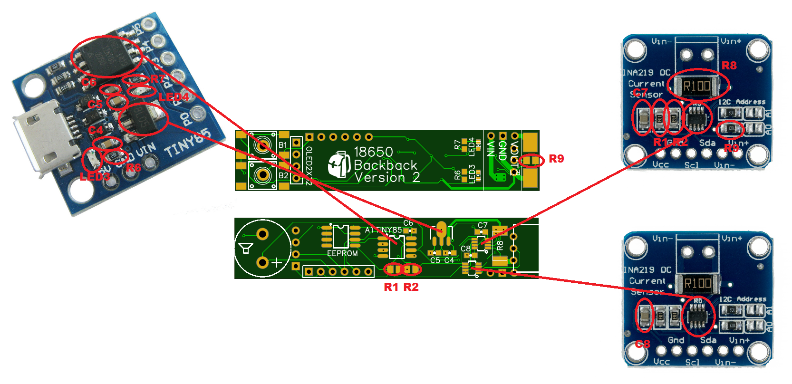
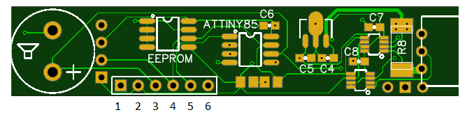

# 18650-Backpack

- 9V regulator... no more Fatshark alarm!
- Settable voltage alarm.  Default 3.10V with a secondary alarm at 3.00V (0.10V below set alarm voltage).  Configurable through the UI.
- Beeper alarm and flashing OLED.
- Monitors over all voltage, cell 1 and cell 2.  When using a Fatshark battery pack without a balance wire the cell voltage is pack voltage divided by 2.  This does not mean the batteries are balanced.
- Current sensor.
- mAh consumption.
- On time.
- Retains on time and mAh when powered down.  Can be cleared for a new battery by pressing any button while plugging in the battery.
- 12 character callsign.  Configurable through the UI.

https://www.youtube.com/watch?v=n1eo8pUAjkk

## Bill of Materials

The below links are give for reference so you know what to search for from your favourite/local supplier.

A hot air rework station (such as the 858D linked below) is required if you use the following BOM.  I used the Digispark Attiny85 and INA219 break out boards as donors for the 18650 Backpack.  This make life easier than ordering ALL of the components separately.

https://www.banggood.com/858D-220V-Hot-Air-Soldering-Rework-Station-Handle-Handle-Stand3-Nozzles-p-1129100.html

- Download the Gerber zip file from the PCB folder and upload it to https://jlcpcb.com, or your preferred PCB manufacturer.
- Digispark Attiny85 (cheap on ebay) https://www.banggood.com/ATTINY85-Mini-Usb-MCU-Development-Board-For-Arduino-p-971122.html
- 2 x INA219 High Side DC Current Sensor (cheap on ebay) https://www.adafruit.com/product/904
- Pololu 9V Step-Up Voltage Regulator U3V12F9 https://www.pololu.com/product/2116 ( for the Aussies https://core-electronics.com.au/pololu-9v-step-up-voltage-regulator-u3v12f9.html)
- OLED 128x32 https://www.banggood.com/0_91-Inch-128x32-IIC-I2C-Blue-OLED-LCD-Display-DIY-Oled-Module-SSD1306-Driver-IC-DC-3_3V-5V-p-1140506.html
- AT24C02 SOP-8 Serial EEPROM https://www.ebay.com.au/itm/10pcs-AT24C02-SOP-8-Serial-EEPROM-Memorizer-2KB/271441366188
- Buzzer https://www.banggood.com/5-PCS-Super-Loud-5V-Active-Alarm-Buzzer-Beeper-Tracker-95_5mm-for-Racing-Drone-p-1117207.html
- 2 x Tactile Push Button https://www.banggood.com/100Pcs-5-Pin-Tactile-Push-Button-Switch-Tact-Switch-6-X-6-X-3_1mm-SMD-p-1018679.html
- Power jack https://www.banggood.com/DC-Tip-Power-Plug-Jack-Connector-Dual-5_5-x-2_1mm-Male-Right-Angle-Cord-Cable-p-1161332.html
- 2s balance (male and female) https://www.banggood.com/40-set-2p-3p-4p-5pin-Right-angle-JST-XH-2_5mm-Male-Female-Lipo-Balance-Connector-p-1160571.html

## Flashing the Attiny85

The below can also be done with an Arduino Nano.

https://www.instructables.com/id/Program-an-ATtiny-with-Arduino/

- 1 - Ground
- 2 - D11
- 3 - D12
- 4 - D13
- 5 - D10
- 6 - +5V

## Core and Libs
- https://github.com/damellis/attiny
- https://github.com/datacute/Tiny4kOLED
- https://github.com/jmendeth/power-trinket/blob/master/sketch/_Adafruit_INA219.h (Adafruit_INA219.h using TinyWire)
