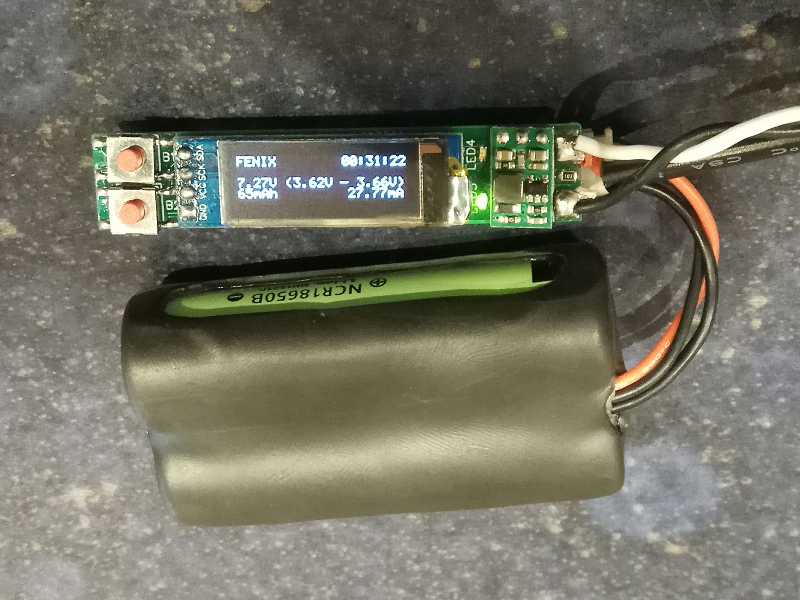
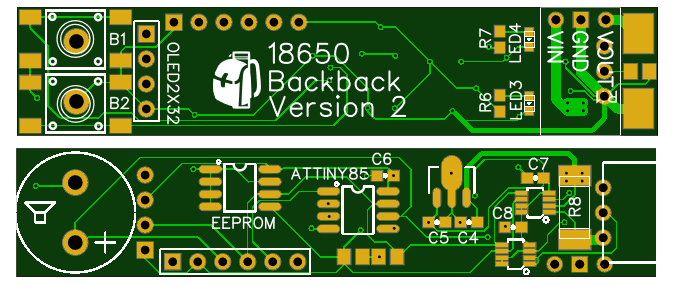

# 18650-Backpack

- 9V regulator... no more Fatshark alarm!
- Settable voltage alarm.  Default 3.10V with a secondary alarm at 3.00V (0.10V below set alarm voltage).  Configurable through the UI.
- Beeper alarm and flashing OLED.
- Monitors over all voltage, plus cell 1 and cell 2.
- Current sensor.
- mAh consumption.
- On time.
- Retains on time and mAh when powered down.  Can be cleared for a new battery by pressing any button while plugging in the battery.
- 12 character callsign.  Configurable through the UI.

## Core and Libs
- https://github.com/damellis/attiny
- https://github.com/datacute/Tiny4kOLED
- https://github.com/jmendeth/power-trinket/blob/master/sketch/_Adafruit_INA219.h (Adafruit_INA219.h using TinyWire)
